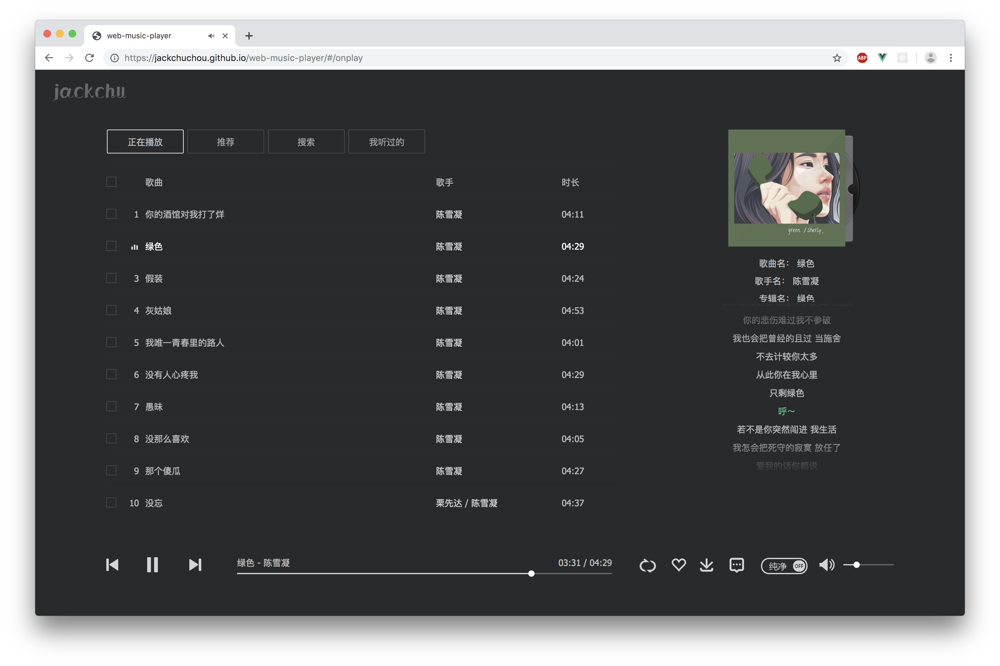
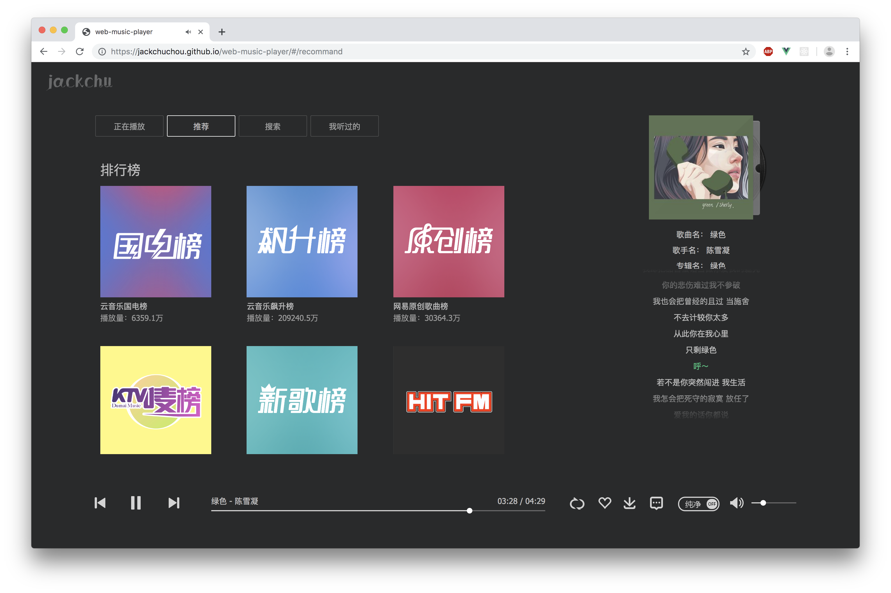
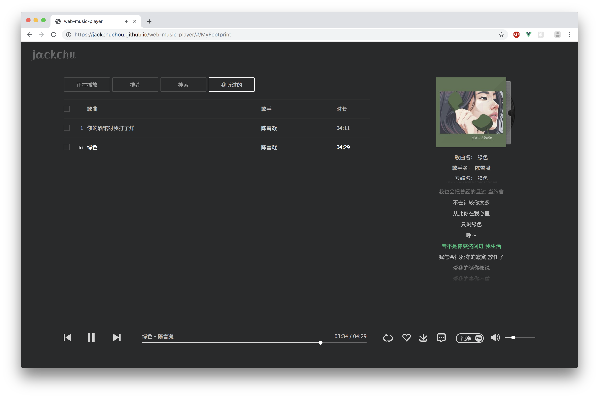

# web-music-player

模仿QQ音乐网页版界面，以PC端为主，暂未兼容移动端，兼容主流浏览器

> api: [网易云音乐 Node.js API service](<https://binaryify.github.io/NeteaseCloudMusicApi/#/>) [maomao1996](http://music.mtnhao.com/)
>
> [在线演示](<https://jackchuchou.github.io/web-music-player/#/>)

> A Vue.js project

## Build Setup

> web-music-player

``` bash
git clone https://github.com/JackChuChou/web-music-player.git

# install dependencies
npm install

# serve with hot reload at localhost:8080
npm start

# build for production with minification
npm run build
```

> 后台服务器

```
git clone https://github.com/Binaryify/NeteaseCloudMusicApi.git

# install dependencies
npm install

# serve running at localhost:3000
npm start
```

> **web-music-player中src/assets/constant.js中BASE_URL要与后台服务器地址一致**

## 技术栈

- Vue-Cli（脚手架工具）
- Vue（框架）
- Vue-Router（路由）
- Vuex（状态管理）
- Scss（CSS预处理器）
- Axios（网络请求）


## 目录结构

<details>
    <summary>展开查看</summary>
    <pre>
    	<code>
├── README.md
├── build									// vue配置文件
│   ├── build.js
│   ├── check-versions.js
│   ├── logo.png
│   ├── utils.js
│   ├── vue-loader.conf.js
│   ├── webpack.base.conf.js				// webpack基本环境配置
│   ├── webpack.dev.conf.js					// webpack开发环境配置
│   └── webpack.prod.conf.js				// webpack生产环境配置
├── config
│   ├── dev.env.js
│   ├── index.js
│   └── prod.env.js
├── index.html
├── package-lock.json
├── package.json
├── src										// 源码目录
│   ├── App.vue								// 根组件
│   ├── api									// 网络请求封装
│   │   └── index.js
│   ├── assets								// 资源目录
│   │   ├── constant.js						// 全局常量
│   │   ├── css								
│   │   │   └── global.sass					// 全局样式
│   │   └── images							// 精灵图及图标
│   │       ├── album_cover_player.png
│   │       ├── back.svg
│   │       ├── comment.png
│   │       ├── comment2X.png
│   │       ├── icon_list_menu.png
│   │       ├── icon_list_menu2X.png
│   │       ├── icon_player.png
│   │       ├── icon_player2X.png
│   │       ├── icon_sprite.png
│   │       ├── icon_sprite2X.png
│   │       ├── logo_jackchu.png
│   │       ├── play_icon.png
│   │       ├── player_cover.png
│   │       ├── player_logo.png
│   │       └── wave.gif
│   ├── components							// 组件目录
│   │   ├── ArtistDetail.vue				// 歌手详细
│   │   ├── LoadingMask.vue					// 加载遮罩
│   │   ├── PlayFt.vue						// 播放控制
│   │   ├── Playlist.vue					// 歌单
│   │   ├── SideBar.vue						// 侧边栏
│   │   ├── SongList.vue					// 歌曲列表
│   │   └── TopNav.vue						// 顶部导航栏
│   ├── main.js								// 入口主文件
│   ├── pages								
│   │   ├── HomePage.vue					// 首页
│   │   ├── MyFootprint.vue					// 足迹
│   │   ├── OnPlay.vue						// 正在播放
│   │   ├── Recommand.vue					// 推荐
│   │   ├── Search.vue						// 搜索
│   ├── router
│   │   └── index.js						// 路由配置
│   ├── store
│   │   ├── actions.js						
│   │   ├── index.js						// 创建store
│   │   ├── modules							// 模块状态
│   │   │   ├── detail.js
│   │   │   ├── history.js
│   │   │   ├── onPlay.js
│   │   │   ├── recommand.js
│   │   │   └── search.js
│   │   ├── mutationTypes.js
│   │   └── mutations.js
│   └── utils								// 工具类
│       ├── playlist			
│       │   └── index.js					// 格式化歌单
│       └── song
│           └── index.js					// 格式化歌曲
└── static									// 静态资源
    └── img
        ├── footprint.png
        ├── onplay.png
        ├── recommand.png
        └── search.png
    	</code>
    </pre>
</details>


## 功能

- [x] 播放、暂停
- [x] 播放模式（顺序、随机、单曲循环、列表循环）
- [x] 音量控制
- [x] 播放进度调整
- [x] 上一首、下一首
- [x] 歌词查看
- [x] 榜单及歌单推荐
- [x] 搜索
- [x] 已播放列表
- [ ] 登录
- [ ] 下载
- [ ] 分享
- [ ] 评论
- [ ] 纯净模式


## 界面

### 正在播放



### 推荐



### 搜索


### 足迹

